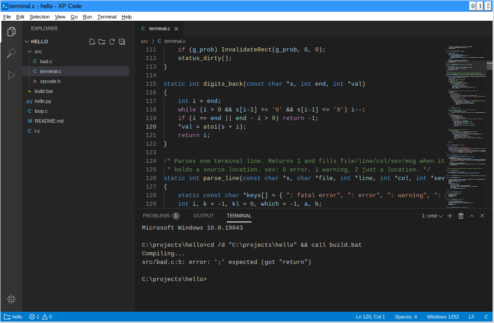
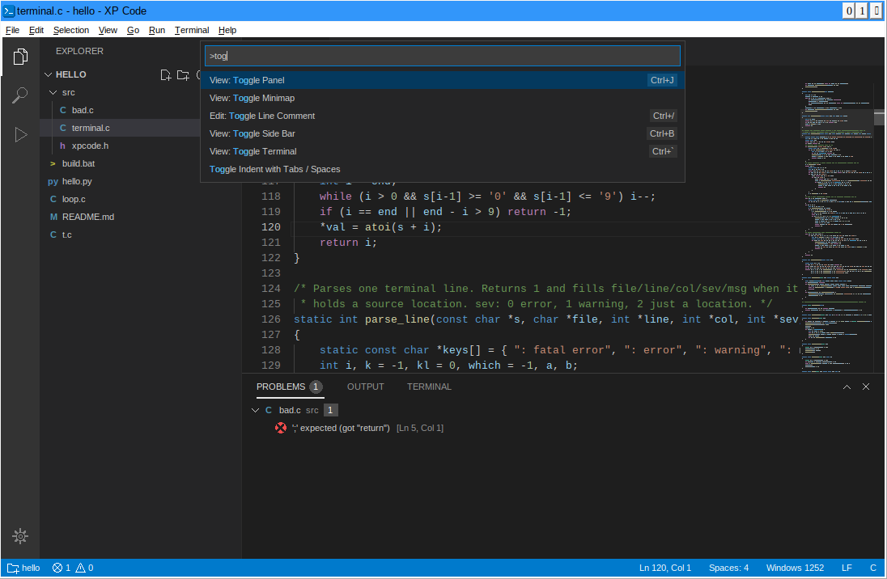
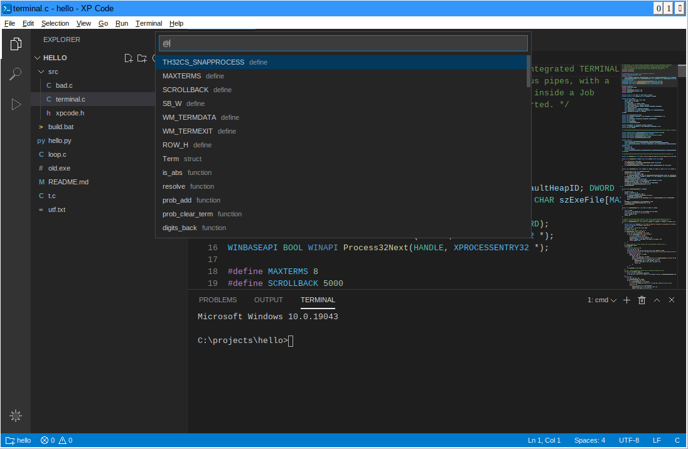
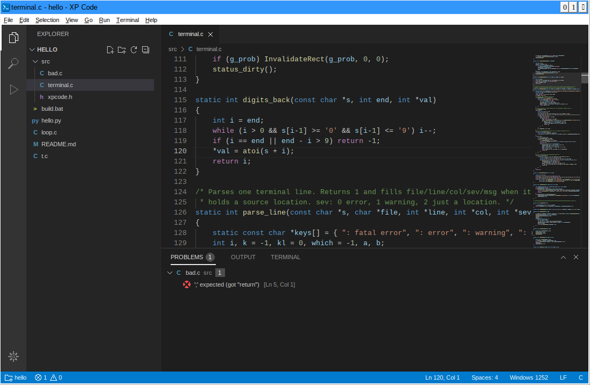

# TinyCodeXP (XP Code)

A small code editor for Windows XP in the style of VS Code. It is plain
Win32 C, built with Tiny C Compiler, and the whole program is one
**193 KB** exe with no runtime, no Electron and no browser engine.

Current version: **1.1.0** (2026-10-03). See [Changes](#changes).



## Why

Modern editors no longer run on XP. XP Code gives an old 32-bit machine
the parts of VS Code people use most: a file tree, tabs, syntax colours,
a real cmd.exe terminal, and a Problems panel fed by compiler output.

## Requirements

- Windows XP SP2 or SP3, 32-bit (also runs on later Windows).
- No install. Download [`build/xpcode.exe`](build/xpcode.exe), copy it anywhere and run it.
- Optional: TCC to compile C with F5, Python to run `.py` files.

## Features

### Editor
- Syntax colours for C/C++, Python, JavaScript, Batch, INI, HTML/XML and Markdown.
- Line numbers, indent guides, bracket matching, auto-indent.
- Auto-closing brackets and quotes; typing a bracket around a selection wraps it.
- Undo and redo with many levels; typing merges into one step.
- Move, copy and delete lines; toggle line comment; indent and outdent.
- Find and replace with match case, whole word and a match count.
- Minimap, zoom, and a custom dark scroll bar.
- Reloads a file when it changes on disk, and asks first if you have unsaved edits.
- Keeps CRLF or LF line endings as the file had them. Reads UTF-8 (with or without BOM).
- Click the encoding in the status bar to save as UTF-8, UTF-8 with BOM or Windows (ANSI).
  New files are UTF-8.

### Workbench
- Activity bar with Explorer, Search and Run views.
- Explorer tree: new file, new folder, rename, delete (to the Recycle Bin), reveal in Explorer.
  The tree refreshes itself when files change.
- Search across files, with results grouped by file. Skips `node_modules`, `build`,
  `dist`, `__pycache__`, `target` and `obj`.
- Tabs with a dot for unsaved changes, breadcrumbs, and a status bar.
- Side bar and bottom panel can be resized and hidden.
- Command Palette (Ctrl+Shift+P or F1), Quick Open (Ctrl+P), Go to Line (Ctrl+G) and
  Go to Symbol (Ctrl+Shift+O, or `@` in Quick Open), all with fuzzy matching.
  Go to Symbol lists functions, structs, classes and defines in C, JavaScript and Python,
  headings in Markdown, sections in INI files and labels in batch files.
- Quick Open skips hidden and system files (Thumbs.db, desktop.ini) and build output
  such as .exe, .dll, .obj and .pyc.
- The mouse wheel scrolls whatever is under the pointer, as on newer Windows.
  Over the tab strip it switches tabs.





### Terminal
- A real `cmd.exe` in the bottom panel. Open as many as you like.
- Command history (Up/Down) and Tab completion of file names.
- Ctrl+C stops the running program and leaves cmd running.
- Select with the mouse, copy, paste (right-click copies a selection, or pastes).
- Scrollback.
- Closing a terminal ends every process it started (it uses a Job Object).
- If a program is still running when you press F5 or Ctrl+Shift+B, the command goes to a
  new terminal instead of the running program's input.

### Problems
- Reads errors and warnings printed in any terminal:
  - TCC and GCC: `file:line: error: ...`
  - MSVC: `file(line) : error C2143: ...`
  - Python tracebacks: `File "x.py", line 5`
- Counts show on the Problems tab and in the status bar.
- Click a problem, press F8, or Ctrl+click the line in the terminal to jump to it.



### Run and build
F5 saves and runs the active file in the terminal:

| File | Command |
| --- | --- |
| `.c` | compile with TCC, then run the exe |
| `.py` | `python -u file.py` |
| `.bat`, `.cmd` | `call file.bat` |
| `.js`, `.vbs` | `cscript //nologo file` |
| `.html` | opens in the default browser |

Ctrl+Shift+B runs `build.bat` in the open folder. Shift+F5 sends Ctrl+C.

XP Code looks for TCC in a `tcc` folder next to `xpcode.exe`, then for
`tcc.exe` next to it, then on PATH. A `tcc` folder next to the exe also goes
on PATH for every terminal, so `tcc` works there without setup.

### Sessions
XP Code remembers the open folder, open files and caret positions, the
window size and layout, and the zoom level.

## Keyboard shortcuts

| Keys | Action |
| --- | --- |
| Ctrl+Shift+P, F1 | Command Palette |
| Ctrl+P | Quick Open |
| Ctrl+G | Go to Line |
| Ctrl+Shift+O | Go to Symbol |
| Ctrl+K Ctrl+O | Open Folder |
| Ctrl+N / Ctrl+O / Ctrl+S | New / Open / Save |
| Ctrl+K S | Save All |
| Ctrl+W | Close tab |
| Ctrl+Tab | Next tab |
| Ctrl+B | Toggle side bar |
| Ctrl+J | Toggle panel |
| Ctrl+\` | Toggle terminal |
| Ctrl+Shift+\` | New terminal |
| Ctrl+Shift+E / F / D | Explorer / Search / Run view |
| Ctrl+Shift+M | Problems |
| Ctrl+F / Ctrl+H | Find / Replace |
| F3 / Shift+F3 | Next / previous match |
| Ctrl+D | Select word, then next match |
| Ctrl+L | Select line |
| Ctrl+/ | Toggle comment |
| Alt+Up / Alt+Down | Move line |
| Shift+Alt+Up / Down | Copy line |
| Ctrl+Shift+K | Delete line |
| Ctrl+] / Ctrl+[ | Indent / outdent |
| Ctrl+Shift+\\ | Go to matching bracket |
| F5 / Shift+F5 | Run active file / stop |
| Ctrl+Shift+B | Run build.bat |
| F8 / Shift+F8 | Next / previous problem |
| Ctrl++ / Ctrl+- / Ctrl+0 | Zoom in / out / reset |
| Ctrl+, | Open settings |
| Help > About | Version and build date |
| Ctrl+K Ctrl+S | List all shortcuts |

## Settings

Settings live in `xpcode.ini`. If that file sits next to `xpcode.exe`, XP
Code uses it there (handy on a USB stick). Otherwise it uses
`%APPDATA%\XP Code\xpcode.ini`. Ctrl+, opens it.

```ini
[editor]
font=Lucida Console

[run]
tcc=C:\tcc\tcc.exe
python=C:\Python27\python.exe
```

The editor font falls back from Consolas to Lucida Console to Courier New.

## Building

You need [Tiny C Compiler](https://bellard.org/tcc/) 0.9.27 for Win32.

On Windows, put `tcc.exe` on PATH (or unpack TCC into a `tcc` folder in
this repo) and run:

```
build.bat
```

From Linux or macOS, with an `i386-win32-tcc` cross compiler and any host C
compiler (no Wine needed):

```
TCC=i386-win32-tcc ./build.sh
```

Both write `build\xpcode.exe`. The build has two steps:

1. TCC compiles `src\*.c`. TCC ships import libraries only for kernel32,
   user32, gdi32 and msvcrt, so XP Code loads everything else (comdlg32,
   shell32, ole32, comctl32 and newer kernel32 calls) at run time.
2. TCC cannot compile `.rc` files, so `tools\rsrc.c` adds the icon and the
   visual styles manifest to the exe as a new `.rsrc` section.

The source also builds with MinGW (`i686-w64-mingw32-gcc`).

## Layout

```
src/main.c       window, layout, commands, menus, tabs, run, session
src/editor.c     text buffer, undo, painting, keys, find and replace
src/syntax.c     line lexers for each language
src/terminal.c   cmd.exe hosting, terminal view, Problems, Output
src/explorer.c   file tree, search view, run view
src/palette.c    Command Palette, Quick Open, Go to Line
src/xpcode.h     shared types and declarations
tools/rsrc.c     adds icon and manifest to the exe
tools/make_icon.py  makes res/xpcode.ico
res/             icon and manifest
```

## Limits

- Text is converted to the ANSI code page when loaded. UTF-8 files open
  and save, but characters outside that code page show as ?. XP Code warns
  when a file has such characters and asks before saving over them.
- No word wrap, no multiple cursors, no split editors, no extensions.
- The terminal is cmd.exe through pipes, not a console. Full-screen console
  programs (edit, more with paging) will not draw correctly.
- Tested under Wine 9 (see screenshots). Not yet tested on a real XP
  machine, with MSVC output, or with XP visual styles turned on.

## Changes

### 1.1.0 (2026-10-03)

Fixes:
- Every editor line now ends with a 0 byte, so bracket matching and
  Backspace never read past the end of a line. NUL bytes in a file no
  longer count as brackets.
- Opening a UTF-8 file with characters the ANSI code page cannot hold no
  longer loses them silently: XP Code says so on load and asks before saving.
- F5 and Ctrl+Shift+B no longer type into a program that is still running.
  They open a new terminal instead. A command sent to a brand new terminal
  now waits for its first prompt, so it is not shown twice.
- F5 on a C file no longer tries to start the exe when the compile fails
  (Wine's cmd.exe ignored the `&&`).
- The folder picker leaked the shell's item list each time; it now frees it.
- An unknown file type with a long extension could overflow a message
  buffer in F5. Run commands now use bounded formatting.
- The terminal now checks that its reader thread started.
- `build.bat` can rebuild `build\xpcode.exe` while that exe is running (it
  moves the locked file out of the way first).
- `tools/rsrc.c` places the new section after the larger of the last
  section's virtual and raw sizes, so it can never overlap.

Improvements:
- Help > About shows the version, release date and build time.
- Go to Symbol (Ctrl+Shift+O or `@`).
- Encoding picker in the status bar; new files default to UTF-8.
- Quick Open keeps its file list until the folder changes, instead of
  rescanning every time it opens. It skips hidden, system and binary files.
- The Explorer hides hidden and system files.
- The find bar paints through a back buffer, so it no longer flickers.
- The mouse wheel goes to the pane under the pointer; over tabs it
  switches tabs.
- `build.sh` builds the resource tool with the host compiler, so it no
  longer needs Wine.

### 1.0.0 (2026-10-03)

First release.
